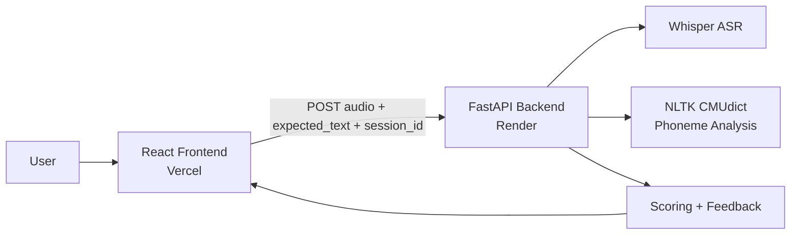

# SpeakRightAI

Real-time AI pronunciation coach with speech transcription, phoneme-level feedback, scoring, and session progress tracking.

## Live Links

| Service | URL |
|---|---|
| Frontend | [https://speakright-ai.vercel.app/](https://speakright-ai.vercel.app/) |
| Backend | [https://speakrightai.onrender.com](https://speakrightai.onrender.com) |
| API Docs | [https://speakrightai.onrender.com/docs](https://speakrightai.onrender.com/docs) |

## What It Does

SpeakRightAI helps users practice pronunciation by comparing what they intended to say with what they actually spoke. The user enters a target sentence, records speech through the browser microphone or uploads an audio file, and receives structured feedback from the backend.

The backend transcribes the audio with OpenAI Whisper, normalizes the spoken and expected text, and calculates a similarity score. It then performs phoneme-level analysis using the NLTK CMU Pronouncing Dictionary so the feedback can go beyond simple text matching and identify sound-level pronunciation issues.

The application returns a pronunciation score, grade, coaching feedback, transcribed text, phoneme breakdown, and previous attempt history. The frontend presents these results in a polished React interface with a score display, expandable phoneme analysis, and session-based progress tracking.

Core capabilities:

- Browser-based microphone recording and audio upload
- Whisper-powered speech transcription
- Text similarity comparison between expected and spoken output
- Phoneme extraction and comparison using CMUdict
- Pronunciation score and grade generation
- Human-readable coaching feedback
- Session-based progress history
- Production deployment with Vercel for the frontend and Render for the backend

## Demo


## Architecture



Production deployment:

```text
Vercel Frontend -> Render Backend -> Whisper + Phoneme Engine
```

## How It Works

```text
Audio Input
    |
    v
Whisper Transcription
    |
    v
Phoneme Extraction
    |
    v
Phoneme Comparison + Scoring
    |
    v
Score + Feedback -> Frontend
```

## Tech Stack

| Layer | Technology |
|---|---|
| Frontend | React, Vite, Tailwind CSS, Framer Motion |
| Backend | FastAPI, Python 3.10, Uvicorn |
| Speech Recognition | OpenAI Whisper |
| Phoneme Analysis | NLTK CMU Pronouncing Dictionary |
| Audio Processing | FFmpeg |
| Configuration | Pydantic Settings |
| Containerization | Docker, Docker Compose |
| Backend Hosting | Render |
| Frontend Hosting | Vercel |

## Project Structure

```text
speakrightAI/
|-- app/
|   |-- main.py
|   |-- api/routes/
|   |-- core/
|   |-- models/
|   `-- services/
|-- frontend/
|   |-- src/
|   |-- package.json
|   `-- Dockerfile
|-- Dockerfile.backend
|-- docker-compose.yml
|-- render.yaml
|-- requirements.txt
`-- .env.example
```

## Local Setup

### Prerequisites

- Python 3.10+
- Node.js 18+
- FFmpeg available on PATH
- Git

### Backend

```bash
git clone https://github.com/RR-1902/speakrightAI.git
cd speakrightAI
python -m venv venv
```

Activate the environment:

```bash
# Windows
venv\Scripts\activate

# macOS/Linux
source venv/bin/activate
```

Install dependencies and start the API:

```bash
pip install -r requirements.txt
python -m nltk.downloader cmudict
uvicorn app.main:app --reload --port 8000
```

Backend checks:

- `http://localhost:8000/health`
- `http://localhost:8000/docs`

### Frontend

```bash
cd frontend
npm install
```

Create `frontend/.env.local`:

```env
VITE_API_BASE_URL=http://localhost:8000
```

Start the frontend:

```bash
npm run dev
```

Frontend runs at:

- `http://localhost:5173`

## Docker

Run the full stack locally:

```bash
docker compose up --build
```

| Service | URL |
|---|---|
| Frontend | `http://localhost:5173` |
| Backend Docs | `http://localhost:8000/docs` |

## Environment Variables

### Backend

| Variable | Default | Description |
|---|---|---|
| `APP_ENV` | `development` | Application environment |
| `WHISPER_MODEL` | `tiny` | Whisper model size |
| `WHISPER_DEVICE` | `cpu` | PyTorch inference device |
| `MAX_UPLOAD_SIZE_MB` | `25` | Maximum audio upload size |
| `CORS_ORIGINS` | required | Comma-separated allowed frontend origins |

Production example:

```env
APP_ENV=production
WHISPER_MODEL=tiny
WHISPER_DEVICE=cpu
MAX_UPLOAD_SIZE_MB=25
CORS_ORIGINS=https://speakright-ai.vercel.app
```

### Frontend

| Variable | Description |
|---|---|
| `VITE_API_BASE_URL` | Backend API URL without a trailing slash |

Production value:

```env
VITE_API_BASE_URL=https://speakrightai.onrender.com
```

## Deployment

Important: deploy the backend to Render, not Vercel or Netlify serverless. Whisper, PyTorch, FFmpeg, and audio processing are too heavy for a simple serverless-first backend deployment.

### Backend -> Render

1. Open [Render](https://render.com)
2. Create a new Web Service
3. Connect the GitHub repository `RR-1902/speakrightAI`
4. Use the following settings:

| Field | Value |
|---|---|
| Name | `speakrightai-backend` |
| Runtime | Docker |
| Branch | `main` |
| Root Directory | leave empty |
| Dockerfile Path | `Dockerfile.backend` |
| Build Command | leave empty |
| Start Command | leave empty |
| Health Check Path | `/health` |

5. Add environment variables:

```env
APP_ENV=production
WHISPER_MODEL=tiny
WHISPER_DEVICE=cpu
MAX_UPLOAD_SIZE_MB=25
CORS_ORIGINS=https://speakright-ai.vercel.app
```

6. Deploy
7. Verify:
   - `https://speakrightai.onrender.com/health`
   - `https://speakrightai.onrender.com/docs`

### Frontend -> Vercel

1. Open [Vercel](https://vercel.com)
2. Import the GitHub repository `RR-1902/speakrightAI`
3. Use the following settings:

| Field | Value |
|---|---|
| Root Directory | `frontend` |
| Framework Preset | Vite |
| Build Command | `npm run build` |
| Output Directory | `dist` |

4. Add environment variable:

```env
VITE_API_BASE_URL=https://speakrightai.onrender.com
```

5. Deploy

## API Reference

| Method | Endpoint | Description |
|---|---|---|
| `GET` | `/health` | Health check |
| `POST` | `/api/v1/speech/transcribe` | Upload audio and receive transcription, score, feedback, and phoneme analysis |

Interactive API docs are available at:

- [https://speakrightai.onrender.com/docs](https://speakrightai.onrender.com/docs)

## Known Issues & Fixes

### Windows PyTorch DLL Load Failure

```text
OSError: [WinError 1114] A dynamic link library initialization routine failed.
```

Fix:

1. recreate the virtual environment
2. reinstall dependencies cleanly
3. install the Microsoft Visual C++ Redistributable

This is a local Windows issue. Docker on Render avoids it.

### CORS Error After Deployment

Cause:

- Render `CORS_ORIGINS` does not include the Vercel URL

Fix:

```env
CORS_ORIGINS=https://speakright-ai.vercel.app
```

Then redeploy the backend.

### Render Port Binding

Render assigns `$PORT` dynamically. The backend Dockerfile already handles it:

```dockerfile
CMD ["/bin/sh", "-c", "uvicorn app.main:app --host 0.0.0.0 --port ${PORT:-8000}"]
```

## Current Limitations

- Progress is stored in memory and resets on server restart
- Whisper cold starts can be slow on free hosting
- CPU inference is slower than GPU inference
- Larger audio files take longer to process

## Future Improvements

- Persistent progress storage
- Real-time streaming feedback
- Multi-language pronunciation support
- AI-generated voice correction
- Authentication
- Mobile app support

## Author

Rohith Rajan

Full-Stack and AI Systems Developer
