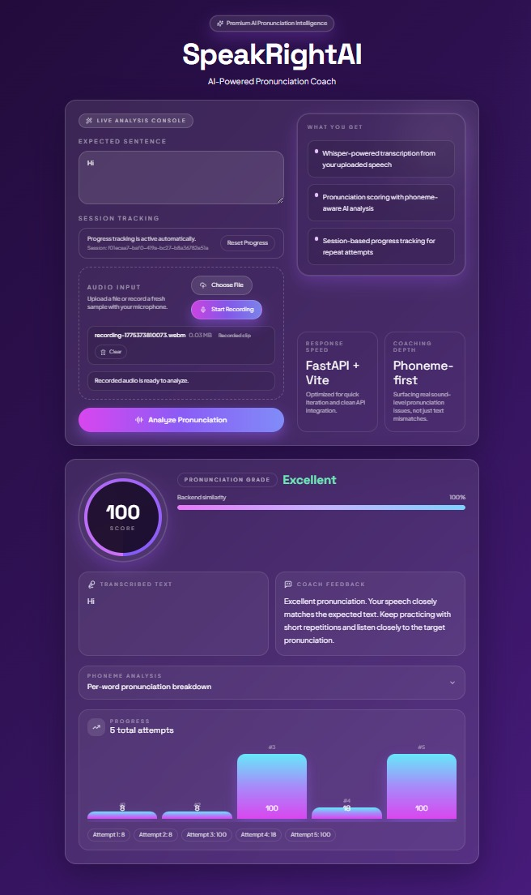

# SpeakRightAI 🎤

AI-powered pronunciation coaching system with real-time speech input, phoneme-level analysis, and intelligent feedback.

---

## 🌟 Features

- 🎤 Live microphone recording + audio upload
- 🧠 Phoneme-level pronunciation analysis (CMUdict)
- 📊 AI-based pronunciation scoring system
- 📈 Session-based progress tracking
- ⚡ Whisper-powered speech-to-text
- 🎨 Modern glassmorphism UI (React + Tailwind)

---

## 🧠 How It Works

Speech → Transcription → Phoneme Analysis → Error Detection → Score + Feedback

---

## 📸 Demo



---

## 🛠 Tech Stack

### Backend
- FastAPI
- OpenAI Whisper
- NLTK (CMU Pronouncing Dictionary)
- Python

### Frontend
- React (Vite)
- Tailwind CSS

### DevOps
- Docker
- Docker Compose

---

## 🚀 Quick Start (Docker)

```bash
git clone https://github.com/RR-1902/speakrightAI
cd speakrightAI
docker-compose up --build
