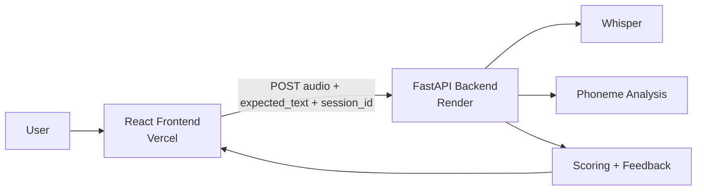

# SpeakRightAI

AI-powered pronunciation coach with:

- speech-to-text using Whisper
- phoneme-level pronunciation analysis
- pronunciation scoring and grading
- progress tracking across attempts

Repository:

- [RR-1902/speakrightAI](https://github.com/RR-1902/speakrightAI)

Live frontend:

- [https://speakright-ai.vercel.app/](https://speakright-ai.vercel.app/)

Backend:

- Render deployment in progress

Local project path:

- [C:\Users\vtr96\OneDrive\Documents\New project](/C:/Users/vtr96/OneDrive/Documents/New%20project)

---

## Deploy Fast

Use this production setup:

- Backend -> Render
- Frontend -> Vercel

Deploy order:

1. deploy backend on Render
2. copy backend URL
3. deploy frontend on Vercel
4. set `VITE_API_BASE_URL` to the Render backend URL
5. set backend `CORS_ORIGINS` to the Vercel frontend URL

---

## Architecture



Request flow:

1. user records or uploads audio
2. frontend sends audio to backend
3. backend transcribes audio with Whisper
4. backend compares text and phonemes
5. backend returns score, grade, feedback, and history
6. frontend displays results

---

## Stack

### Frontend

- React
- Vite
- Tailwind CSS
- Framer Motion

### Backend

- FastAPI
- Uvicorn
- OpenAI Whisper
- PyTorch
- NLTK CMUdict
- FFmpeg

---

## Local Run

### Backend

From [C:\Users\vtr96\OneDrive\Documents\New project](/C:/Users/vtr96/OneDrive/Documents/New%20project):

```bash
python -m venv .venv
.venv\Scripts\activate
pip install --upgrade pip
pip install -r requirements.txt
python -m nltk.downloader cmudict
uvicorn app.main:app --host 127.0.0.1 --port 8000 --reload
```

Backend URLs:

- API: [http://127.0.0.1:8000](http://127.0.0.1:8000)
- Docs: [http://127.0.0.1:8000/docs](http://127.0.0.1:8000/docs)
- Health: [http://127.0.0.1:8000/health](http://127.0.0.1:8000/health)

Important:

- `ffmpeg` must be installed and available in PATH
- use a clean virtual environment on Windows

### Frontend

From [C:\Users\vtr96\OneDrive\Documents\New project\frontend](/C:/Users/vtr96/OneDrive/Documents/New%20project/frontend):

```bash
npm install
npm run dev
```

Frontend URL:

- App: [http://127.0.0.1:5173](http://127.0.0.1:5173)

---

## Environment Variables

### Backend

Supported:

- `APP_ENV`
- `WHISPER_MODEL`
- `WHISPER_DEVICE`
- `MAX_UPLOAD_SIZE_MB`
- `CORS_ORIGINS`

Example:

```bash
APP_ENV=production
WHISPER_MODEL=tiny
WHISPER_DEVICE=cpu
MAX_UPLOAD_SIZE_MB=25
CORS_ORIGINS=https://speakright-ai.vercel.app
```

### Frontend

```bash
VITE_API_BASE_URL=https://your-backend.onrender.com
```

---

## Deploy Backend To Render

Use these files:

- [Dockerfile.backend](/C:/Users/vtr96/OneDrive/Documents/New%20project/Dockerfile.backend)
- [render.yaml](/C:/Users/vtr96/OneDrive/Documents/New%20project/render.yaml)

Official docs:

- [Render Web Services](https://render.com/docs/web-services/)
- [Render Docker](https://render.com/docs/docker)

### Step 1. Push code to GitHub

Push your latest code to:

- [RR-1902/speakrightAI](https://github.com/RR-1902/speakrightAI)

### Step 2. Open Render

Go to:

- [https://render.com](https://render.com)

### Step 3. Create Web Service

In Render:

1. click `New +`
2. click `Web Service`
3. connect GitHub
4. choose `RR-1902/speakrightAI`

### Step 4. Fill the form

Use these values:

| Field | Value |
|---|---|
| Name | `speakrightai-backend` |
| Runtime | `Docker` |
| Branch | `main` |
| Root Directory | leave empty |
| Dockerfile Path | `Dockerfile.backend` |
| Health Check Path | `/health` |

### Step 5. Add environment variables

Add:

```bash
APP_ENV=production
WHISPER_MODEL=tiny
WHISPER_DEVICE=cpu
MAX_UPLOAD_SIZE_MB=25
CORS_ORIGINS=https://speakright-ai.vercel.app
```

### Step 6. Deploy

Click `Create Web Service`.

Render will:

- build the backend image
- install FFmpeg
- install Python packages
- download NLTK `cmudict`
- start FastAPI

### Step 7. Test backend

After deploy, Render gives a URL like:

```bash
https://speakrightai-backend.onrender.com
```

Test:

- `https://your-backend.onrender.com/health`
- `https://your-backend.onrender.com/docs`

Save this backend URL. You need it for Vercel.

---

## Deploy Frontend To Vercel

Official docs:

- [Vite on Vercel](https://vercel.com/docs/frameworks/frontend/vite)
- [Vercel Environment Variables](https://vercel.com/docs/projects/environment-variables)

### Step 1. Open Vercel

Go to:

- [https://vercel.com](https://vercel.com)

### Step 2. Create Project

In Vercel:

1. click `Add New`
2. click `Project`
3. import `RR-1902/speakrightAI`

### Step 3. Set root directory

Set:

```bash
frontend
```

### Step 4. Confirm build settings

| Field | Value |
|---|---|
| Framework Preset | `Vite` |
| Root Directory | `frontend` |
| Build Command | `npm run build` |
| Output Directory | `dist` |

### Step 5. Add environment variable

```bash
VITE_API_BASE_URL=https://your-backend.onrender.com
```

Example:

```bash
VITE_API_BASE_URL=https://speakrightai-backend.onrender.com
```

### Step 6. Deploy

Click `Deploy`.

Your live frontend URL is:

```bash
https://speakright-ai.vercel.app/
```

### Step 7. Final CORS check

Go back to Render and confirm:

```bash
CORS_ORIGINS=https://speakright-ai.vercel.app
```

If you changed it, save and redeploy the backend.

---

## Final Test

After both deployments:

1. open the Vercel frontend
2. enter expected text
3. upload or record audio
4. click analyze
5. verify results appear

Expected output:

- transcribed text
- pronunciation score
- grade
- feedback
- phoneme analysis
- progress history

---

## Common Deployment Issues

### 1. Frontend loads but API calls fail

Check:

- `VITE_API_BASE_URL` is correct in Vercel
- backend is awake on Render
- `CORS_ORIGINS` matches the Vercel domain exactly

### 2. Render deploy succeeds but backend does not respond

Check:

- `/health` works
- Render logs show Uvicorn started
- `Dockerfile.backend` is being used

### 3. CORS error in browser

Fix:

- set backend `CORS_ORIGINS=https://speakright-ai.vercel.app`
- redeploy backend

### 4. Whisper is slow on first request

This is normal on cold start, especially on free hosting.

---

## Docker

For local full-stack containers:

- [Dockerfile.backend](/C:/Users/vtr96/OneDrive/Documents/New%20project/Dockerfile.backend)
- [frontend/Dockerfile](/C:/Users/vtr96/OneDrive/Documents/New%20project/frontend/Dockerfile)
- [docker-compose.yml](/C:/Users/vtr96/OneDrive/Documents/New%20project/docker-compose.yml)

Run:

```bash
docker compose up --build
```

Local Docker URLs:

- frontend: [http://localhost:5173](http://localhost:5173)
- backend: [http://localhost:8000](http://localhost:8000)

---

## API

### Endpoints

- `GET /health`
- `POST /api/v1/speech/transcribe`

### Request fields

- `file`
- `expected_text`
- `session_id`

### Example cURL

```bash
curl -X POST "http://127.0.0.1:8000/api/v1/speech/transcribe" \
  -F "file=@sample.wav" \
  -F "expected_text=Hello and welcome to SpeakRightAI" \
  -F "session_id=demo-session-1"
```

---

## Current Limitations

- session tracking is in memory only
- Whisper cold starts can be slow
- CPU inference is slower than GPU inference
- large audio files take longer to process

---

## Next Improvements

1. move session history to a database
2. add authentication
3. store audio in cloud storage
4. add background jobs
5. add custom domains
